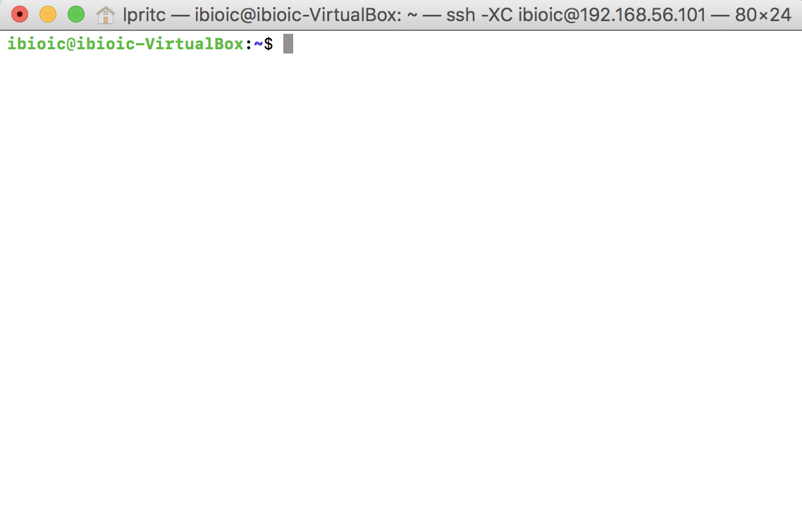
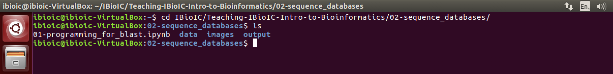
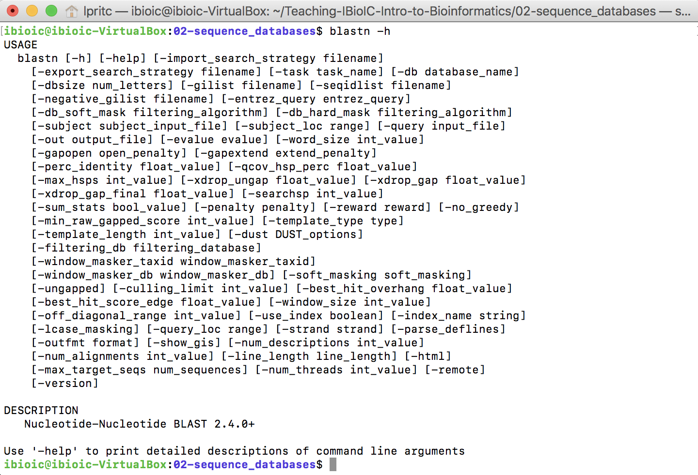
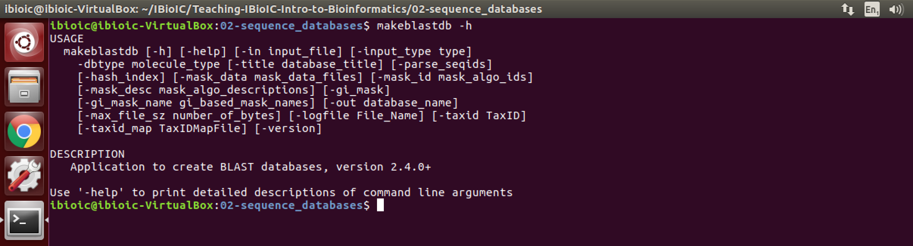
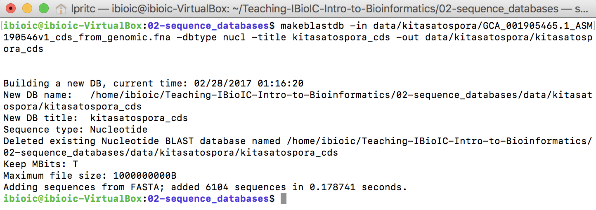
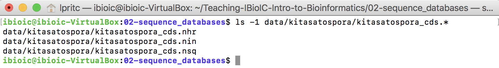

# 02-`BLAST+` at the terminal

## Introduction

The `BLAST/BLAST+` package can be installed on your own machine (desktop or laptop) or on a shared server. This gives you full control over how to use the program, and allows you to build custom databases (useful for proprietary information). However, you are limited to the computing power you have available. Happily, `BLAST` doesn't require excessive amounts of computing resources and for many tasks a desktop or laptop machine is sufficient.

### Resources

* [`ncbi-blast+` download](https://blast.ncbi.nlm.nih.gov/Blast.cgi?PAGE_TYPE=BlastDocs&DOC_TYPE=Download)
* [Original publication: Altschul *et al.* (1990)](http://dx.doi.org/10.1016/S0022-2836(05)80360-2)
* [Gapped `BLAST` publication: Altschul *et al.* (1997)](https://www.ncbi.nlm.nih.gov/pmc/articles/PMC146917/)

## Using `BLAST+` in the terminal

* Open a terminal window in the virtual machine (VM)



* Change directory to the `02-sequence_databases` lesson directory:

```
cd IBioIC/Teaching-IBioIC-Intro-to-Bioinformatics/02-sequence-databases
ls
```



* Establish that `BLASTN` works by issuing a command to get the short help message:

```
blastn -h
```



### Build a `BLAST+` database

The program that builds `BLAST+` sequence databases is `makeblastdb`. You can get basic help on the command by issuing:

```
makeblastdb -h
```


To build a `BLAST` database we need to provide the following information:

1. A file containing the sequences that will be in the database
2. What kind of sequence (nucleotide or protein) data the file contains
3. A name for the database (optional)
4. A path to write the database files to (optional)

* Create a new `BLAST` database with the following command:

```
makeblastdb -in data/kitasatospora/GCA_001905465.1_ASM190546v1_cds_from_genomic.fna \
            -dbtype nucl
            -title kitasatospora_cds \
            -out data/kitasatospora/kitasatospora_cds
```

This will return some information to the terminal, and create the database.



This creates three files, which together comprise a new `BLAST` nucleotide database against which you can make queries.



### QUESTIONS

1. Use the following command to get the long-format help messages for `BLASTN` and `BLASTX`: `blastn -help` and `blastx -help`. Pay particular attention to the options for output `-outfmt` and `-o`, and the options that control the general search options.