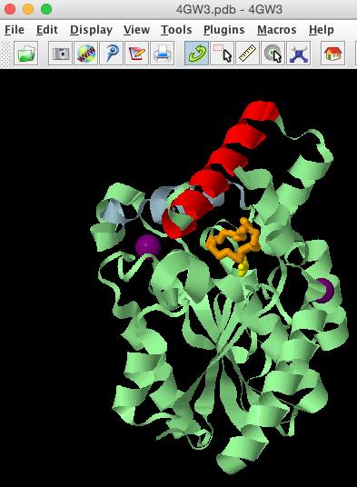
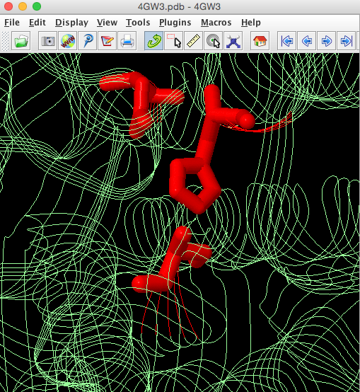

## 03-Protein structure visualization and analysis practical
### Introduction
So far all our analyses have been based on gene sequences and the protein sequences they encode. Proteins have a secondary and tertiary structure (and some also have a quarternary structure). Information about protein structures are stored in the RCSB (also known as the PDB) and it comprises >127K biological structures, of which 123K are proteins.

### 03-01 Exploring the RSCB for PML structures
We will use the RCSB to search for the structures of PMLs and explore  their 3D structures. Its is possible to search the RCSB in a number of ways, including by PBDcode ID, keywords (not recommended) and sequence similarity.

From the previous session on PML sequences it is possible to find the PDB code ID for the WT PML is 4GW3 (there were cross references to the RCSB from the [Uniprot entry: B4EVM3_PROMH](http://www.uniprot.org/uniprot/B4EVM3)


####03-01-01 Searching the RCSB
Use the search box at the top of the [RCSB homepage](http://www.rcsb.org/) to search for entry 4GW3.


This shows the "Structure Summary" page for [4GW3](http://www.rcsb.org/pdb/explore/explore.do?structureId=4gw3)

![PDB 4GW3 entry] (images/PDB-4GW3.png)

Note the different tabs at the top of the entry which give access to difference types of information about the 4GW3 structure.

Using the expanded Macromolecules section of the Structure Summary page, 

![PDB 4GW3 Domain] (images/expand-domain-view.png)

we see that this structure has one sequence domain and we will come back to view this domain on the structure later.

![PDB 4GW3 Domain] (images/RCSB-4GW3-domain2.png)


#####Exercise 1: [10 mins] Browse the RCSB 4GW3 entry and answer the following questions
#####Answer the following questions: 

1. What method has been used to solve the structure of 4GW3 and is the "quality" of the structure suitable for analysis of its molecular structure?
2. What ligands does this PML structure have bound?
3. How many amino residues does this PML structure have?
4. What is the protein stoichiometry of 4GW3?
5. Which Pfam domain is present in this protein and what residues does it span?
5. How many other proteins in the PDB share 40% sequence similarity with 4GW3 and do you think that these structures all have the same structure and function?


####03-01-02 PM Lipases in the RCSB database
Using the sequence similarity tab to view the sequence similarity clusters of 4GW3. This shows that there are 4 structures that have 95% sequence identity. 


| RCSB Code  | Structure Description | 
|:------------- |:--------------- 
| 4GW3      	| PML- wild type (WT)   
| 4GXN     	| PML -WT Diethylphosphonate Inhibited                  
|4HS9			| PML Methonal tolerant mutant      
|3W9u 			| PM Lipk107         

We will concentrate on the first 3 structures, as the 4th is poorly annotated and does not have a publication associated with the RCSB entry. Hence it is more uncertain what this structure actually is.


### 03-02 Visualization of PML structures using a web-based tool (NGL)
RCSB uses a number of web-based applications (e.g. JSmol and NGL) to allow visualization of protein structures directly from their webpages. 

Click on the [3D View tab]( http://www.rcsb.org/pdb/explore/jmol.do?structureId=4GW3&bionumber=1) at the top of the 4GW3 entry to view the structure. By default it loads the JSmol application, but use the selection box below the structure to use NGL.
 

 
 This will load 4GW3 showing the secondary structure. 
 
 

You can use the Diplay and View Options to alter how the protein and its ligands are depicted. The colour scheme options can be used to display the surface of the protein in different ways E.g. Colour by hydrophobicity (hydrophobic residues do not like to reside in an aqueous environment).


If there are ligands or ions in the structure you can use the Interaction option to zoom in and display the binding pockets and amino acids involved in the interactions. E.g Binding pocket for PA


#####Exercise 2: [10mins]
Use the Display and Viewer Options on the right hand side to 

1. colour 4GW3 by secondary structure 
2. show the position of calcium ions in 4GW3
3. view the surface of the protein and colour by hydrophocity
4. view the surface of the protein and colour by b-factor

#####Answer the following questions: 

1. What fold does 4GW3 have? Search the [CATH database](http://www.cathdb.info/) to help you answer this.
2. What amino acids residues are involved in binding Calcium ion CA 401?
3. What does the hydrophobicty colour scheme show you about the binding pocket where ligands PE and PA occur?
4. Each atom of protein crystal structure can have a B-factor (also known as the temperature or Debye-Waller factor ) associated with it. This essentially describes the degree to which the electron desnity is spread out. When you colour the protein surface by this factor what do you think it shows you? 

### 03-03 Visualizing PML structure in Jmol using scripting
So far we have used the web based viewer NGL to visualise a protein structure. But using such web based browsers is limited as we cannot carry out more complex visualizations such as 

* selecting specific atoms of interest 
* superimposing a number of different structures   
* animating structures for a presentation or demonstration
 
In this section of the practical we will view and analyse the PML structures using [Jmol](http://jmol.sourceforge.net), an open source molecular viewer which allows scripting.

Jmol has 3 basic elements: the viewing window, the console and the script editor. The console is where script commands can be entered at a command-line prompt and these commands then make changes to the structure loaded in the viewing window. The script-editor is where a series of Jmol commands can be put together in script and the stript run, to makes as series of changes to the structure in the veiwing window in one go. Depending on what set-up you are using you can drag and drop scripts into the console (or on soem systems you can Ctrl-C and Ctrl-V). See the [Jmol wiki](http://wiki.jmol.org/index.php/Copying_and_pasting_scripts) for more details


PML has a number of structural features that are essential for its function.

1. Ca binding site: plays a role in catalysis and stability 
2. Active site pocket which has 2 lid helices a5 and a8
3. A catalytic triad
5. An Oxyanion hole which is stablised by water residues


We will use Jmol scripting to analyse some of these different elements to help us understand how structure is related to function.
Aims of this activity:

1. load PML WT structure into Jmol
2. View the secondary structure 
3. Map the Pfam domain onto the structure
4. Identify the ligands in the structure and the two lid helices (a5(125-143) and a8 (213-224)
5. Identify the catalytic triad 
6. Identify the calcium binding site and the supporting loop region


#### 03-03-01: Jmol - importing, viewing, rendering, colouring
* Open a terminal window in the virtual machine (VM)
* Launch Jmol by typing

```
Jmol
```
You should see the Jmol window appear


Load the PML WT file uisng File menuu


Enter 4 digit PDB model ID : 4GW3 and the model will be automatically imported directly from the RCSB database ino the Jmol viewer


The structure is automatically loaded in ball-and-stick format
and the default coloration is CPK (Corey, Pauling, Kultun), based on atom identity. 

Launch the console window from the File Menu


In the console window type the following commands. Use a return at the end of each command to see the structure change in the Jmol main window

```
select all
ribbons
colour palegreen
```
This will change the structure in the viewing window to look like this


In the RCSB one Pfam domain was mapped to this structure covering residues 6-120, let us identify these in the structure.

```
select 6-120
colour red
```


Question: How does the Pfam sequence domain relate to the 3D fold of the protein?


Ligands in the structure: from the RCSB Summary page we know that 4GW3 has 4 unique ligands.


We will use Jmol to highlight these ligands and the two lid helices in the structure. As this is a lot of commands to type, open the script Editor window. 


Drag and drop the commands into the Editor window and then Run the commands


```
select all
ribbons only
colour palegreen
select [IPA]
colour yellow
wireframe 150
select [1PE]
colour orange
wireframe 150
select [CA]
colour purple
spacefill
select 125-143
colour lightgrey
select 213-224
colour lightblue
spin
```

This will render your protein to look like this and spin it round, you can re-orientate the molecule in the Viewer window and then let it spin so you can see different aspects of the protein.




The catalytic triad: We know form the publication associated with 4GW3 [PMID:
23300806] (https://www.ncbi.nlm.nih.gov/pubmed/23300806) PML contains a hydrolase Ser-His-Asp catalytic triad with the catalytic serine (Ser79) being part of a GXSXG motif. The catalytic His is residue 254 and the catalytic Asp is 232.
We will highlight the catalytic triad to see how residues that are widely spaced in the sequence are brought together in 3D space in the protein structure.

```
select all
strands only
colour palegreen
select ser79,his254,asp232
colour red
wireframe 100

```


The side chains of these catalytic residues are brought close together in the folded protein to form the active site pocket.




The CA binding site and support loop. ONE CAT atome (401) is invovled the the protein's function and this calcium is bound through intercations with a short loop region (that is rendered in Jmol partly loop, partly helical). This is an important site to take note of when we considered the mutated protein structure.

```
select all
cartoons only
colour palegreen
select CA401
colour purple
spacefill
select 213-224
colour pink
select 202-210
colour red
```


Exercise 3: Visualization of the mutated protein. Can you highlight the residues that have been muatted and see what effects they have?


Questions

#### 03-03-02: Jmol - superimposing multiple structures
There are many different programs that can be used to superimpose protein structures to observe differences. It is possible to superimpose protein structures through web-based tools from the RCSB that directly load the results into a Jmol viewer. But as disucssed previously this limits what you can do with the superimposed structures in terms of viewing specific elemnets of interest.

Here we will use the FATCAT tool to superimpose the wild type PML (PDB: 4GW3) and the mutated enzyme Dieselzyme (4HS9) to understand and how the mutations affect the protein structure.

Dieselyme4 (4HS9) has 11 mutations added compared to the WT PML.
Clip table from paper.

The mutations cluster into 2 regions: Region 1 near helices 1 and 2 and Regions 2 near calcium binding site. 

Disulphide bond: G181C and S238C:
Re-modelled loop residues 200-2008:  

Link to FATCAT website
Run rigid superposition in FATCAT
Download superimposed file (save a copy in case website fails)
Load superimposed structures into Jmol (use open file)
Highlight salt bridge?
Highlight remodelled loop

**Questions?

#### 03-03-03: Jmol - animating structures
Basic animation - spin - 
Animate a structure using a scipt ..mmmm how?
Save animatio as a movie

Get students to save movie and show to others.

Launch the script editor window from the File Menu


### But what if we have no structure, can we make predictions?


References

* [Jmol website](http://jmol.sourceforge.net)


* [Jmol interactive scripting documentation] (http://chemapps.stolaf.edu/jmol/docs/)

* [Intro to Jmol Scripting webpage: Nathan Silva and David Marcey (2016)](http://earth.callutheran.edu/Academic_Programs/Departments/BioDev/omm/jsmol/scripting/molmast.htm)

* Programmatic conversion of crystal structures into 3D printable files using Jmol
Vincent F. Scalfani,Antony J. Williams,Valery Tkachenko,Karen Karapetyan, Alexey Pshenichnov,Robert M. Hanson,Jahred M. Liddie,5 and Jason E. Bara J Cheminform. 2016; 8: 66.


* AS Rose, AR Bradley, Y Valasatava, JM Duarte, A Prlić and PW Rose. Web-based molecular graphics for large complexes. ACM Proceedings of the 21st International Conference on Web3D Technology (Web3D '16): 185-186, 2016. doi:10.1145/2945292.2945324
    
    
*AS Rose and PW Hildebrand. NGL Viewer: a web application for molecular visualization. Nucl Acids Res (1 July 2015) 43 (W1): W576-W579 first published online April 29, 2015. doi:10.1093/nar/gkv402


Leighton's examples formatting:

* [`ncbi-blast+` download](https://blast.ncbi.nlm.nih.gov/Blast.cgi?PAGE_TYPE=BlastDocs&DOC_TYPE=Download)
* [Original publication: Altschul *et al.* (1990)](http://dx.doi.org/10.1016/S0022-2836(05)80360-2)
* [Gapped `BLAST` publication: Altschul *et al.* (1997)](https://www.ncbi.nlm.nih.gov/pmc/articles/PMC146917/)

* Create a new `BLAST` database with the following command:

### QUESTIONS


Jmol stuff

