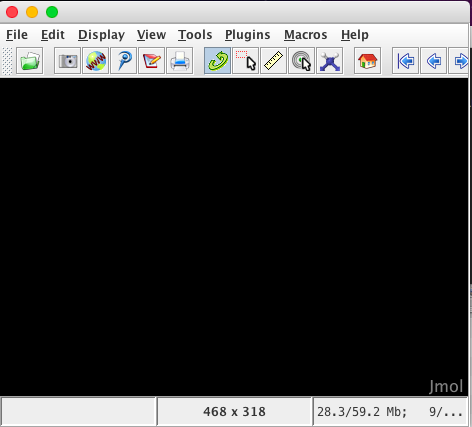
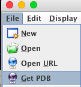
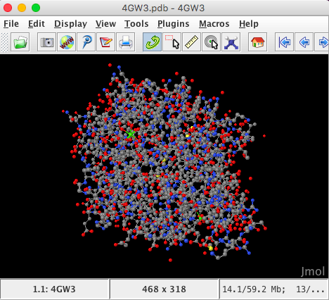

 


## 03-Protein structure visualization and analysis practical
### Introduction
So far all our analyses have been based on gene sequences and the protein sequences they encode. 
RCSB contains xxx

### 03-01 Exploring the RSCB for PML structures
Let us search for PML structures in the RCSB database


#### PM Lipases in the RCSB database
Our searches of the RCSB revealed a number of PML structures 


| RCSB Code  | Structure Description | 
|:------------- |:--------------- 
| 4GW3      	| PML- wild type (WT)   
| 4GXN     	| PML -WT Diethylphosphonate Inhibited                  
|4HS9			| PML Methonal tolerant mutant      
|3W9u 			| PM Lipk107         

We will concentrate on the first 3 structures, as the 4th is poorly annotated and does not have a publication associated with the RCSB entry. Hence it is more uncertain what this structure actually is.


### 03-02 Visualization of protein strutuctres using web-based tools (NGL or Jsmol)


### 03-03 Visualizing PML structure in Jmol using scripting
So far we have used the web based viewer XX to visual our protein structures of interest. But using such web based browsers is limited as we cannot carry out more complex visualizations such as 
* (1) selecting specific atoms of interest 
* (2) superimposing a number of different structures   
* (3) animating structures for a presentation
 
 In this section of the practical we will view and analyse the PML structures using Jmol scripting

#### 03-03-01: Jmol - importing, viewing, structure rendering, colouring
* Open a terminal window in the virtual machine (VM)
* See if Jmol launches a window by typing

```
Jmol
```
You should see the Jmol window appear



Load the PML WT file uisng File menuu



Enter 4 digit PDB model ID : 4GW3 and the model will be automatically imported directly from the RCSB database ino the Jmol viewer



The structure is automatically loaded in ball-and-stick format
and the default coloration is CPK (Corey, Pauling, Kultun), based on atom identity. 

####Question:  Which atoms are red and which atoms are grey in the CPK colour scheme?

Let us explore the use of scripting to alter the image of the structure

Launch the console window from the File Menu

![JMol-console(images/Jmol-console.png)


In the console window type the following commands in turn (the $ at the start of each line is just the prompt in the console window). Use a return at the end of each command to see the structure change in the Jmol main window

```
$select all
$ribbons
$colour palegreen
```

Question: Using the RCSB information on 4GW3 which protein resiudes comprise the catalytic triad which is the enzyme active site? [RCSB: 4GW3] (http://www.rcsb.org/pdb/explore/explore.do?structureId=4GW3)


Use [SAS tool](http://www.ebi.ac.uk/thornton-srv/databases/sas/) to take a closer look at the functionally important residues in 4GW3

We know form the publication associated with 4GW3 (linkout here) PML contains a hydrolase Ser-His-Asp catalytic triad with the catalytic serine (S79) being part of a GXSXG motif. 

Now highlight the catalytic triad in 4GW3 to see how residues that are widely spaced in the sequence are brought together in 3D space in the protein structure.

```
$select all
$strands only
$colour palegreen
$select ser79,his254,asp232
$colour red
$wireframe 100

```

Next bits: use CPK/surface to show cleft in molecule with HIS_ASP-SER acessible

==Do it yourself==: Activity 1: do rendering on inhibited molecule on their own.
Questions

#### 03-03-01: Jmol - superimposing multiple structures


**Questions?


Overlap 2/3 structures and see differences.


Activity: do rendering on inhibited molecule on their own.


Animate a structure using a scipt ..mmmm how?


Launch the script editor window from the File Menu


References

* [Jmol website](http://jmol.sourceforge.net)


* [Jmol interactive scripting documentation] (http://chemapps.stolaf.edu/jmol/docs/)

* [Intro to Jmol Scripting webpage: Nathan Silva and David Marcey (2016)](http://earth.callutheran.edu/Academic_Programs/Departments/BioDev/omm/jsmol/scripting/molmast.htm)
Programmatic conversion of crystal structures into 3D printable files using Jmol
Vincent F. Scalfani,Antony J. Williams,Valery Tkachenko,Karen Karapetyan, Alexey Pshenichnov,Robert M. Hanson,Jahred M. Liddie,5 and Jason E. Bara J Cheminform. 2016; 8: 66.


Leighton's examples formatting:

* [`ncbi-blast+` download](https://blast.ncbi.nlm.nih.gov/Blast.cgi?PAGE_TYPE=BlastDocs&DOC_TYPE=Download)
* [Original publication: Altschul *et al.* (1990)](http://dx.doi.org/10.1016/S0022-2836(05)80360-2)
* [Gapped `BLAST` publication: Altschul *et al.* (1997)](https://www.ncbi.nlm.nih.gov/pmc/articles/PMC146917/)

* Create a new `BLAST` database with the following command:

### QUESTIONS

