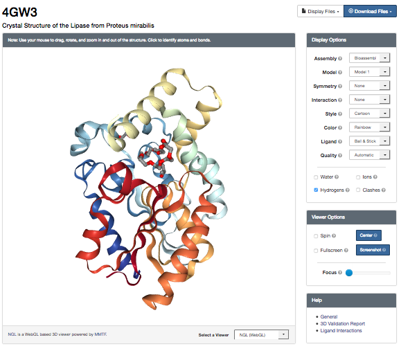
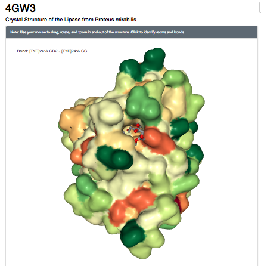
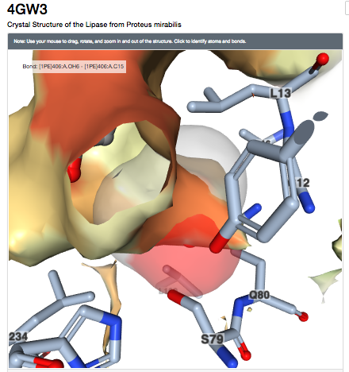

## 03-Protein structure visualization and analysis practical
### Introduction
So far all our analyses have been based on gene sequences and the protein sequences they encode. Proteins have a secondary, tertiary structures (and some a quarternary structure). Information about protein structures are stored in the RCSB (also known as the PDB) and it > 127K biological structures, of which 123K are proteins.

### 03-01 Exploring the RSCB for PML structures
We will use the RCSB to search for the structures of PMLs and explore  their 3D structures. Its is possible to search the RCSB in a number of ways, including by PBDcode ID, keywords (not recommended) and sequence similarity.

From the previous session on PML sequences it is possible to find the PDB code ID for the WT PML is 4GW3 (have the students linked to the sequences through any resources that cross refernces PDB code?)

####03-01-01 Searching the RCSB
Use the search box at the top of the [RCSB homepage](http://www.rcsb.org/) to search for entry 4GW3.


This shows the "Structure Summary" page for [4GW3](http://www.rcsb.org/pdb/explore/explore.do?structureId=4gw3)

![PDB 4GW3 entry] (images/PDB-4GW3.png)

Note the different tabs at the top of the entry which give access to differnece types of information about the 4GW3 structure.

####Questions: 

1. What method has been used to solve the structure of 4GW3 and is the "quality" of the structure suitable for analysis of its molecular structure?
2. What ligands does this PML structure have bound?
3. How many amino residues does this PML structure have?
4. What is the protein stoichiometry of 4GW3?
5. How many other proteins in the PDB share 40% sequence similarity with 4GW3 and do you think that these structures all have the same structure and function?


####03-01-02 PM Lipases in the RCSB database
Using the sequence similarity tab to view the sequence similarity clusters of 4GW3. This shows that there are 4 structures that have 95% sequence identity. 


| RCSB Code  | Structure Description | 
|:------------- |:--------------- 
| 4GW3      	| PML- wild type (WT)   
| 4GXN     	| PML -WT Diethylphosphonate Inhibited                  
|4HS9			| PML Methonal tolerant mutant      
|3W9u 			| PM Lipk107         

We will concentrate on the first 3 structures, as the 4th is poorly annotated and does not have a publication associated with the RCSB entry. Hence it is more uncertain what this structure actually is.


### 03-02 Visualization of PML structres using a web-based tool (NGL)
RCSB uses a number of web-based applications (e.g. JSmol and NGL) and to allow visualization of protein structures directly from their webpages. 

Click on the [3D View tab]( http://www.rcsb.org/pdb/explore/jmol.do?structureId=4GW3&bionumber=1) at the top of the 4GW3 entry to view the structure. By default it loads the JSmol application, but use the selection box below the structure to use NGL.
 

 
 This will load 4GW3 showing the secondary structure. 
 
 

You can use the Diplay and View menus to alter how the proteins and its ligands are depicted. The colour scheme options can be used to display the surface of the protein in different ways E.g. Colour by hydrophobicity (hydrophobic residues do not like to reside in an aqueous environment, they tend to hide ).




If there are ligands or ions in the structure you can use the Interaction option to zoom in and display the binding pocktes and amino acids involved in the interactions. E.g Binding pocket for PA




Use the Display Options and the Viewer Options menu on the right hand side to 

1. colour 4GW3 by secondary structure 
2. show the position calcium ions in 4GW3
3. view the surface of the protein and colour by hydrophocity
4. view the surface of the protein and colour by b-factor

Questions: 

1. What fold does 4GW3 have? Access the CATH database to help you answer this.
2. What amino acids residues are involved in binding Calcium ion CA 401?
3. What does the hydrophobicty colour scheme show you about the binding pocket where ligands PE and PA occur?
4. Each atom of protein crystal structure can have a B-factor (also known as the temperature or Debye-Waller factor ) associtaed with it. This essential describes the degree to which the electron desnity is spread out. When you colour the protein surface by this factor what do you think it is showing you? 

### 03-03 Visualizing PML structure in Jmol using scripting
So far we have used the web based viewer JSmol to visual a protein structures. But using such web based browsers is limited as we cannot carry out more complex visualizations such as 

* selecting specific atoms of interest 
* superimposing a number of different structures   
* animating structures for a presentation
 
In this section of the practical we will view and analyse the PML structures using Jmol and Jmol scripting.

Jmol has 3 basic elements: the viewing windox, the console and the script editor. The console is where script commands can be entered at a command-line prompt and these commands then make changes to the structure loaded in the viewing window. The script-editor is where a series of Jmol commands can be put together in script and the stript run, to makes as series of changes to the structure in the veiwing window in one go.


PML has a number of structural features that are essential for its function.

1. Ca binding site: plays a role in catalysis and stability. 
2. Active site pocket (Substrate binding pocket is largely hydrophobic) which has 2 lid helices a5 and a8: PML is in closed conformation, with a5 preventing access to the active site.
3. Oxyanion hole: water mediated stabalization of the hole
4. Catalytic triad


Aims of this activity:

1. load PML WT structure into Jmol
2. View the secondary structure 
3. Identify the catalytic triad on the protein
4. Identify the calcium binding site and the supporting loop region
5. Identify the two lid helices (a8 and a5)


#### 03-03-01: Jmol - importing, viewing, structure rendering, colouring
* Open a terminal window in the virtual machine (VM)
* See if Jmol launches a window by typing

```
Jmol
```
You should see the Jmol window appear


Load the PML WT file uisng File menuu


Enter 4 digit PDB model ID : 4GW3 and the model will be automatically imported directly from the RCSB database ino the Jmol viewer


The structure is automatically loaded in ball-and-stick format
and the default coloration is CPK (Corey, Pauling, Kultun), based on atom identity. 

####Quick Question:  Which atoms are red and which atoms are grey in the CPK colour scheme?

Let us explore the use of scripting to alter the image of the structure

Launch the console window from the File Menu

![JMol-console(images/Jmol-console.png)


In the console window type the following commands in turn (the $ at the start of each line is just the prompt in the console window). Use a return at the end of each command to see the structure change in the Jmol main window

```
$select all
$ribbons
$colour palegreen
```

Question: Using the RCSB information on 4GW3 which protein resiudes comprise the catalytic triad which is the enzyme active site? [RCSB: 4GW3] (http://www.rcsb.org/pdb/explore/explore.do?structureId=4GW3)


Use [SAS tool](http://www.ebi.ac.uk/thornton-srv/databases/sas/) to take a closer look at the functionally important residues in 4GW3

Prosite [http//www....]

We know form the publication associated with 4GW3 (linkout here) PML contains a hydrolase Ser-His-Asp catalytic triad with the catalytic serine (S79) being part of a GXSXG motif. 

Now highlight the catalytic triad in 4GW3 to see how residues that are widely spaced in the sequence are brought together in 3D space in the protein structure.

```
$select all
$strands only
$colour palegreen
$select ser79,his254,asp232
$colour red
$wireframe 100

```

Next bits: use CPK/surface to show cleft in molecule with HIS_ASP-SER acessible

Highlight the two alpha helices that are lids to the catalytic sites (a5 and a8)


==Do it yourself==: Activity 1: do rendering on mutated molecule on their own.
1. Highlight : 

Questions

#### 03-03-02: Jmol - superimposing multiple structures
There are many different programs that can be used to superimpose protein structures to observe differences. It is possible to superimpose protein structures through web-based tools from the RCSB that directly load the results into a Jmol viewer. But as disucssed previously this limits what you can do with the superimposed structures in terms of viewing specific elemnets of interest.

Here we will use the FATCAT tool to superimpose the wild type PML (PDB: 4GW3) and the mutated enzyme Dieselzyme (4HS9) to understand and how the mutations affect the protein structure.

Dieselyme4 (4HS9) has 11 mutations added compared to the WT PML.
Clip table from paper.

The mutations cluster into 2 regions: Region 1 near helices 1 and 2 and Regions 2 near calcium binding site. 

Disulphide bond: G181C and S238C:
Re-modelled loop residues 200-2008:  

Link to FATCAT website
Run rigid superposition in FATCAT
Download superimposed file (save a copy in case website fails)
Load superimposed structures into Jmol (use open file)
Highlight salt bridge?
Highlight remodelled loop

**Questions?

#### 03-03-03: Jmol - animating structures
Basic animation - spin - 
Animate a structure using a scipt ..mmmm how?
Save animatio as a movie

Get students to save movie and show to others.

Launch the script editor window from the File Menu


References

* [Jmol website](http://jmol.sourceforge.net)


* [Jmol interactive scripting documentation] (http://chemapps.stolaf.edu/jmol/docs/)

* [Intro to Jmol Scripting webpage: Nathan Silva and David Marcey (2016)](http://earth.callutheran.edu/Academic_Programs/Departments/BioDev/omm/jsmol/scripting/molmast.htm)

* Programmatic conversion of crystal structures into 3D printable files using Jmol
Vincent F. Scalfani,Antony J. Williams,Valery Tkachenko,Karen Karapetyan, Alexey Pshenichnov,Robert M. Hanson,Jahred M. Liddie,5 and Jason E. Bara J Cheminform. 2016; 8: 66.


* AS Rose, AR Bradley, Y Valasatava, JM Duarte, A Prlić and PW Rose. Web-based molecular graphics for large complexes. ACM Proceedings of the 21st International Conference on Web3D Technology (Web3D '16): 185-186, 2016. doi:10.1145/2945292.2945324
    
    
*AS Rose and PW Hildebrand. NGL Viewer: a web application for molecular visualization. Nucl Acids Res (1 July 2015) 43 (W1): W576-W579 first published online April 29, 2015. doi:10.1093/nar/gkv402


Leighton's examples formatting:

* [`ncbi-blast+` download](https://blast.ncbi.nlm.nih.gov/Blast.cgi?PAGE_TYPE=BlastDocs&DOC_TYPE=Download)
* [Original publication: Altschul *et al.* (1990)](http://dx.doi.org/10.1016/S0022-2836(05)80360-2)
* [Gapped `BLAST` publication: Altschul *et al.* (1997)](https://www.ncbi.nlm.nih.gov/pmc/articles/PMC146917/)

* Create a new `BLAST` database with the following command:

### QUESTIONS


Jmol stuff

