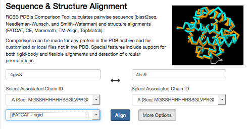
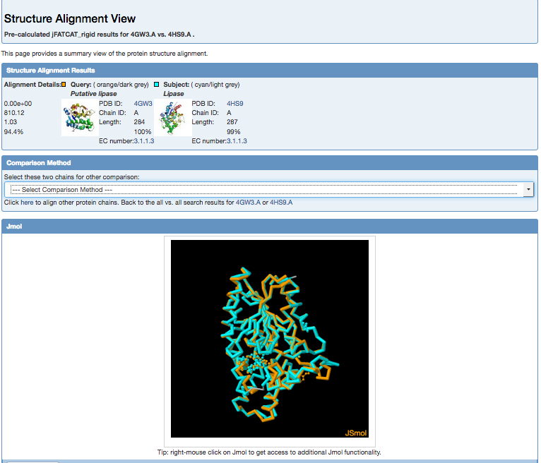
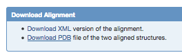
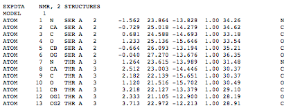

## 04-Protein structure visualization and analysis practical

#### 04-04: Jmol - superimposing multiple structures
It would be easier to compare the WT and the mutant protein strcutures if we could superimpose them. There are many different programs that can be used to superimpose protein structures to observe differences. It is possible to superimpose protein structures through web-based tools from the RCSB. Here we will use the FATCAT tool (accessed via the RCSB database) to superimpose the wild type PML (PDB: 4GW3) and the mutated enzyme Dieselzyme4 (4HS9).

We will see how the mutations in region3 (G181C and S238C) and region 2 (re-modelled loop residues 200-2008) affect the structure. 
 

Go to the [analyse section of the RCSB](http://www.rcsb.org/pdb/home/home.do#Category-analyze). Enter the PDB IDs of the 2 structures (make sure you enter them in the order First: 4gw3, Second: 4hs9 (as this influences how we can maniplulate the structures in Jmol using scripts later on). 


Run the FATCAT rigid superposition. Enter the pdb IDs and select Align.



This gives the alignment results in a new webpage with an interactive Jsmol viewer for quick visualization.



Download the superimposed structures (in PDB format). Scroll to the bottom of the results page and select



This shows the PDB formatted alignment file in a new window and then you can use your webrowser's save-as facility to save the file.



Note that the structural alignment is saved as two models in one PDB file, model 1 (4gw3) and model 2 (4hs9)


Load the superimposed structures into Jmol (use open file).


There are two structures in this file and to select each one separately the notation is 1.1 for the first and 1.2 for the second. Before you use the script below we need to activate both models in the Jmol viewer by right clicking and selecting "All 2 models" and ticking all. 


Now we can use the script below to highlight the mutated regions. Drag and drop this script into your Jmol script editor window and run it.


```
select 1.1
colour palegreen
cartoons only
select 1.2
colour lightblue
cartoons only
select all
wireframe
select 181/1
wireframe 100
colour yellow
select 181/2
wireframe 100
colour red
select 238/1
wireframe 100
colour yellow
select 238/2
wireframe 100
colour red
select 401/1
colour purple
spacefill
select 203/1,204/1,205/1,206/1,207/1
colour yellow
select 203/2,204/2,205/2,206/2,207/2
colour red
```

You will see the two structures superimposed with two mutation regions highlighted.


To take a closer look at the remodelled loop (residues 200-208), add the following commands to the above script.

```
restrict 200-210
select 202,208,210
wireframe 150
```


#####Questions

1. How might the disulphide bond introduced by the G181C/S238C mutations make the structure more thermo stable?
2. How might the remodelling of the loop region caused by the G202E,K208N,G266S mutations influence the effects of methanol?


